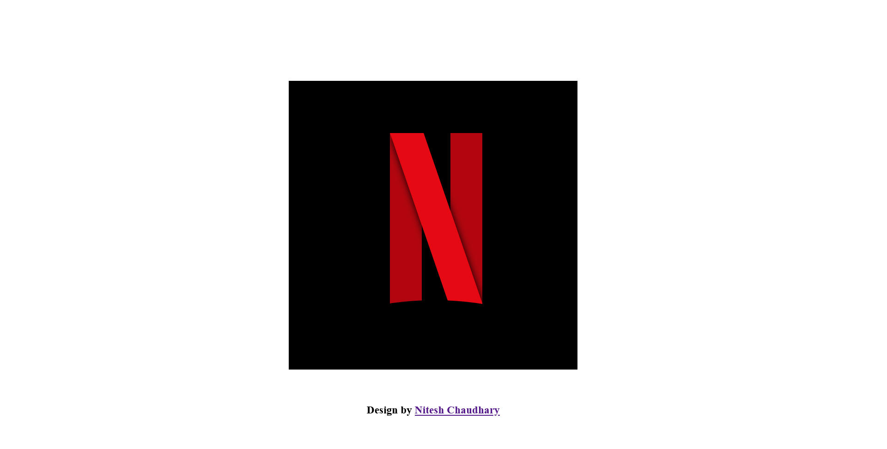

# Logo Design - Netflix Logo

### Screenshot

## Overview

### Built with

- Semantic HTML5 markup
- CSS custom properties

### Description

I manage to design the Netflix logo with the same color and pattern.
The challenges I faced here are the rotation and curvedness of the logo and I happily manage to do that.

## Author

- Frontend Mentor - [@Nitesh-bit](https://www.frontendmentor.io/profile/Nitesh-bit)
